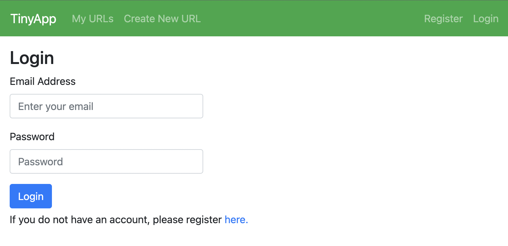

# TinyApp Project

TinyApp is a full stack web application built with Node and Express that allows users to shorten long URLs (à la bit.ly).

## Final Product

1. Welcome Screen

2. Login

3. Register

4. URL Display - No URLs to show

5. Add a new URL

6. URL Display 

## Dependencies

- Node.js
- Express
- EJS
- bcryptjs
- body-parser
- cookie-session

## Getting Started

- Install all dependencies (using the `npm install` command).
- Run the development web server using the `npm start` command.
- Visit the link **http://localhost:8080/urls** in your browser of choice. Please note that this app has only been tested in Google Chrome.
- User must login via the **Login** page to view their URL's on TinyApp. 
- If an account does not exist, one must be created using the **Register** page. 
- If no URL's exist for a user, none will be shown. 
- Once URL's are created, a user can edit or delete their own URLs.
- User can logout via the **Logout** button on the navigation bar.

